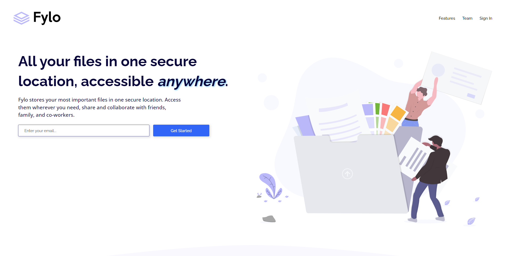

# Frontend Mentor - Fylo landing page with two column layout solution

This is a solution to the [Fylo landing page with two column layout challenge on Frontend Mentor](https://www.frontendmentor.io/challenges/fylo-landing-page-with-two-column-layout-5ca5ef041e82137ec91a50f5). Frontend Mentor challenges help you improve your coding skills by building realistic projects.

## Table of contents

- [Overview](#overview)
  - [The challenge](#the-challenge)
  - [Screenshot](#screenshot)
  - [Links](#links)
- [My process](#my-process)
  - [Built with](#built-with)
  - [What I learned](#what-i-learned)
  - [Continued development](#continued-development)
  - [Useful resources](#useful-resources)
- [Author](#author)
- [Acknowledgments](#Acknowledgments)

## Overview

### The challenge

Users should be able to:

- View the optimal layout for the site depending on their device's screen size
- See hover states for all interactive elements on the page

### Screenshot

### Links

- Live Site URL: [Here](https://igafshell.github.io/fylo-landing-page-with-two-column-layout-main/)

## My process

### Built with

- Basic HTML
- [Sass](https://sass-lang.com/)
- [Font Awesome](https://fontawesome.com/) - icons
- [Figma](https://www.figma.com/) - edit svgs

### What I learned

I learned very much making this project:

- How to use the BEM methodology
- How to use sass
- How to make a whole page responsive
- How to write better code

### Continued development

I'll continue to make web pages with html and css

### Useful resources

Just google and stack overflow

## Author

- Github - [igafshell](https://github.com/igafshell)
- Frontend Mentor - [@igafshell](https://www.frontendmentor.io/profile/igafshell)
- Twitter - [@igafshell](https://www.twitter.com/igafshell)

## Acknowledgments

Thanks Frontend Mentor for the amazing project!
